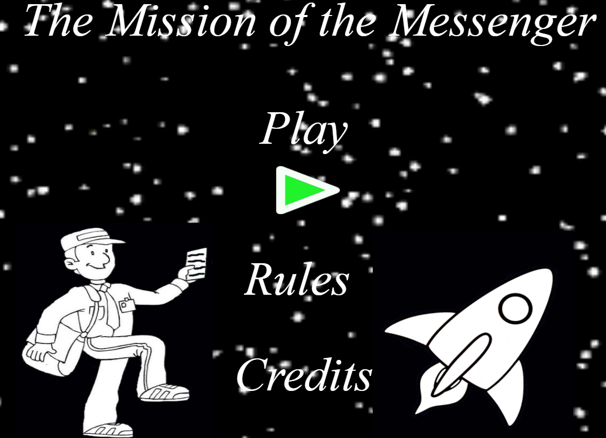

Criando minha página

---
layout: default
---

Criando **minha** _página_ ~~principal~~.

# Quem sou eu

Estudante de Jogos Digitais 

# Portifólio

## Games

[Jogo 1 Oficina: Parkour Junino](https://felipecastroifrn.github.io/ParkourJunino/)  

[Jogo 2 Oficina: A Missão do Mensageiro](https://jefferson141.github.io/A%20miss%C3%A3o%20do%20Mensageiro/)

## Artes

  
  

## Apresentações
* Aula de músicas
* Aula de teatro
* Aula de jogos

* * *

** negrito  
_ italico  
~~ riscado 

#s uma ou mais hashtags criam capítulos ou subcapítulos

*s asteriscos adicionam uma lista não numerada

1s numeros adicionam uma lista numerada

* * *
