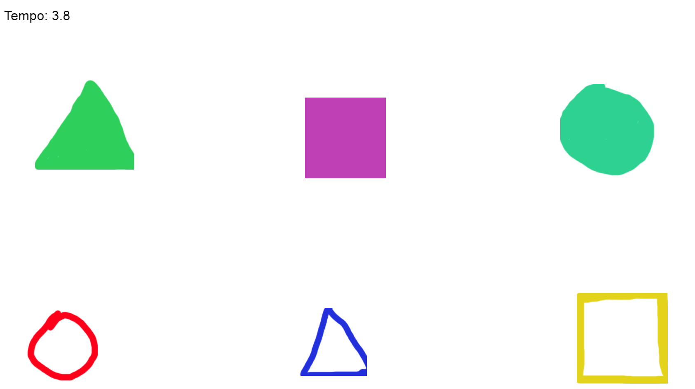
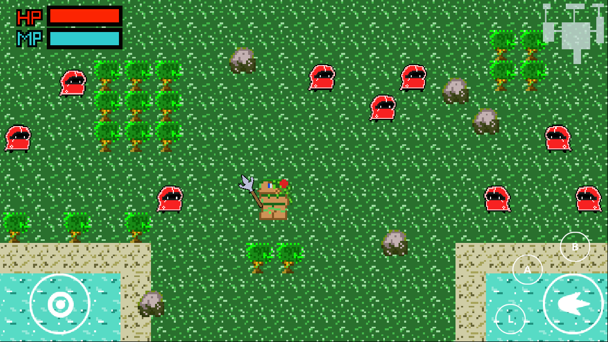
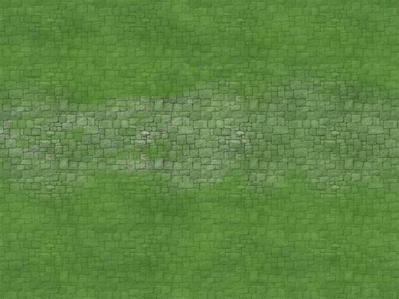
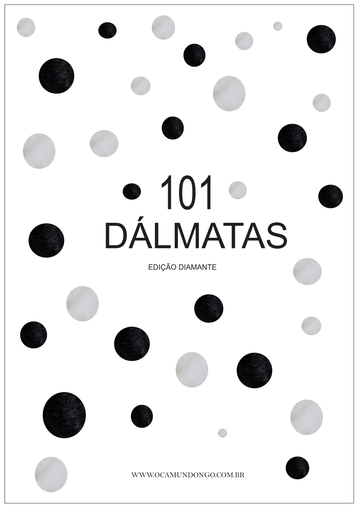
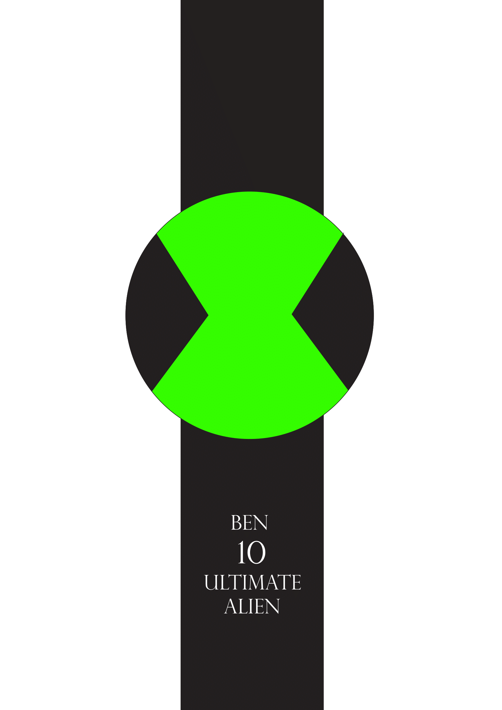

# Portifólio de Jogos Digitais

# Quem sou eu?

Felipe Castro, 18. Técnico em Programação de Jogos Digitais (IFRN - Campus Ceará-Mirim).

# Contatos 

 [Felipe Castro](https://www.facebook.com/profile.php?id=100005745873339) 

 [felipe_castrofc12](https://www.instagram.com/felipe_castrofc12/)

 [Github](https://github.com/felipecastroifrn)

E-Mail: felipecastro12345fc6@gmail.com

## Games

* [Jogo 1 Oficina: Parkour Junino](https://felipecastroifrn.github.io/ParkourJunino/) 

"Parkour Junino" propõe uma aventura por um ambiente com características dos festejos de São João.  

**Colaborador** [Mathues ricardo](theusricardo.github.io)

  

* [Jogo 2 Oficina: A Missão do Mensageiro](https://jefferson141.github.io/A%20miss%C3%A3o%20do%20Mensageiro/)

Uma nave viajando por mundos diferentes, precisa capturar cartas e desviar de diversos inimigos.  

**Colaborador** [Jefferson Araújo](Jefferson141.github.io)

* [Jogo 3 Oficina: World Robot](https://felipecastroifrn.github.io/World%20Robot/)

"World Robot" é um jogo onde um mini robô precisa derrotar naves, para isso ele precisa recarregar seu estoque constantemente.  

**Colaborador** [Arthur Soares](reiarthursr.github.io)  [Tailson Ferreira](Tayllson.github.io)

  

* [Jogo 4: 5 Seconds](https://felipecastroifrn.github.io/New%20project/)  

**Colaborador** [Tailson Ferreira](Tayllson.github.io)

* * *

## MockUp

**Colaborador** [João Pedro](https://bixcoito.github.io/)

* * * 

## Artes

[link para as Artes em Pixel 16x16](https://www.dropbox.com/sh/8trjwivy4rq17gt/AAAkp5V9rOjTG8qtETVoXqOua?dl=0)  

                  
      
   

* * *

## Influence Map

 

* * *  

## Atividades 

**Análise Dramática de um Jogo**

Game Design

[The Legend Of Zelda: Twilight Princess](https://drive.google.com/open?id=15oG5PgSQ808HLPzgi2dnnY6AWUEGKY-f)  

**Tutorial de Multi-Idiomas no Construct 2**

Integrantes: Arthur Soares; Felipe Castro; Tailson Ferreira  

[Tutorial de Multi-Idiomas no Construct 2](https://drive.google.com/file/d/1uzIjZRQQZTVnfCOPD_5z0LbGPdh3q1ot/view?usp=sharing)  

**Jogo da Velha em C++**

Jogo Desenvolvido em linguagem C++ para a matéria de Programação Orientada a Objetos (POO)

[Jogo da Velha - C++](https://drive.google.com/open?id=1GxmH5-X46kaDyO-meNmpO_aeYoWoagdf)  

**Releitura de Pôsters**

Inspiração: 101 Dalmatas

  

Inpiração: Ben 10  

* * *

## Projetos Desenvolvidos

Orientador (a): Daniela Beny Polito Moraes

  

* [Projeto Integrador: TowerDefense](https://reiarthursr.github.io/Torre/)

Orientador (a): Marcelo de Barros Barbosa

O jogo no estilo Tower Defense foi desenvolvido para a matéria de Projeto Integrador, com o intuito de fazer uma junção com o tema saúde ao modo de jogo.

**Colaboradores** [Arthur Soares](reiarthursr.github.io)  [Tailson Ferreira](Tayllson.github.io)

  

* Projeto de Interface - Maquete 3D de um Jogo

Orientador (a): Marcelo de Barros Barbosa

  

* * *

** negrito  
_ italico  
~~ riscado 

#s uma ou mais hashtags criam capítulos ou subcapítulos

*s asteriscos adicionam uma lista não numerada

1s numeros adicionam uma lista numerada

* * *
