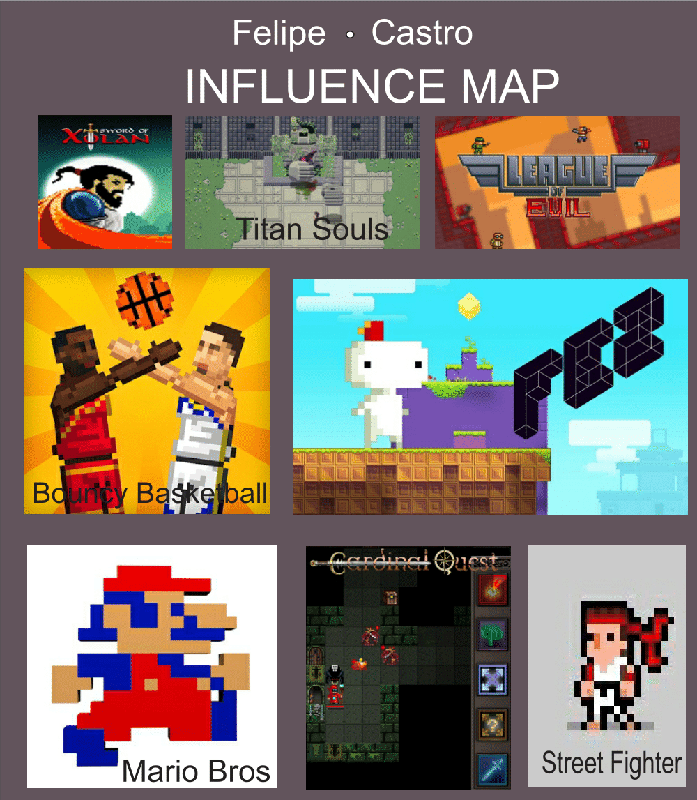
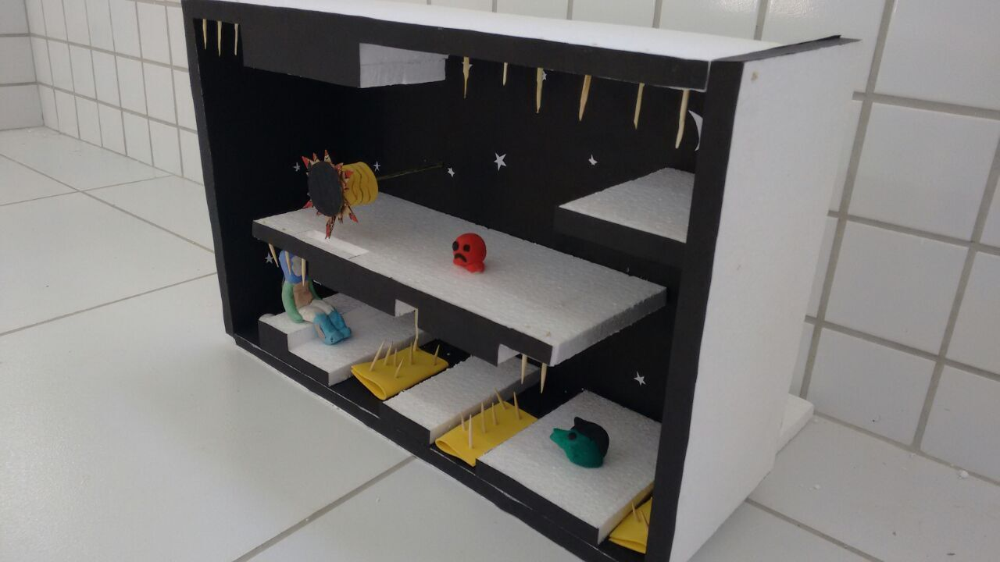
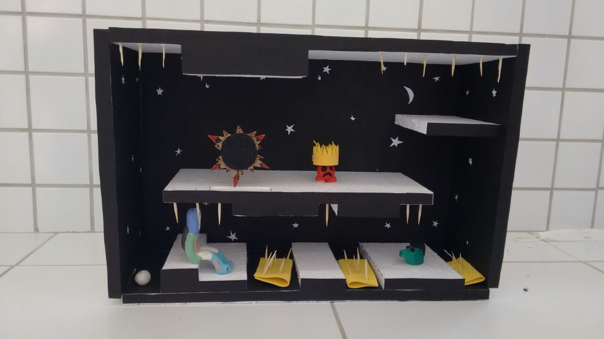

# Portifólio de Jogos Digitais

# Quem sou eu?

Felipe Castro, 18. Técnico em Programação de Jogos Digitais (IFRN - Campus Ceará-Mirim).

# Contatos 

 [Felipe Castro](https://www.facebook.com/profile.php?id=100005745873339) 

 [felipe_castrofc12](https://www.instagram.com/felipe_castrofc12/)

 [Github](https://github.com/felipecastroifrn)

E-Mail: felipecastro12345fc6@gmail.com

## Games

* [Jogo 1 Oficina: Parkour Junino](https://felipecastroifrn.github.io/ParkourJunino/) 

"Parkour Junino" propõe uma aventura por um ambiente com características dos festejos de São João.

  

* [Jogo 2 Oficina: A Missão do Mensageiro](https://jefferson141.github.io/A%20miss%C3%A3o%20do%20Mensageiro/)

Uma nave viajando por mundos diferentes, precisa capturar cartas e desviar de diversos inimigos. 

* [Jogo 3 Oficina: World Robot](https://felipecastroifrn.github.io/World%20Robot/)

"World Robot" é um jogo onde um mini robô precisa derrotar naves, para isso ele precisa recarregar seu estoque constantemente.

   

## MockUp

É AQUI, OXE!

* * * 

## Artes

                    
      

* * *

## Influence Map

 

* * *  

## Atividades 

[Tutorial de Multi-Idiomas no Construct 2](https://drive.google.com/file/d/1uzIjZRQQZTVnfCOPD_5z0LbGPdh3q1ot/view?usp=sharing)  

Integrantes: Arthur Soares; Felipe Castro; Tailson Ferreira  

## Apresentações

* I Expotec - IFRN Campus Ceará-Mirim  

* * *

## Projetos Desenvolvidos

Orientador (a): Daniela Beny Polito Moraes

  

[Projeto Integrador: TowerDefense](https://reiarthursr.github.io/Torre/)

Orientador (a): Marcelo de Barros Barbosa

O jogo no estilo Tower Defense foi desenvolvido para a matéria de Projeto Integrador, com o intuito de fazer uma junção com o tema saúde ao modo de jogo.

  

Projeto de Interface - Maquete 3D de um Jogo

  

* * *

** negrito  
_ italico  
~~ riscado 

#s uma ou mais hashtags criam capítulos ou subcapítulos

*s asteriscos adicionam uma lista não numerada

1s numeros adicionam uma lista numerada

* * *
