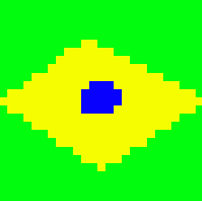

Criando **minha** _página_ ~~principal~~.

# Quem sou eu?

Estudante de Jogos Digitais 

# Portifólio

## Games

[Jogo 1 Oficina: Parkour Junino](https://felipecastroifrn.github.io/ParkourJunino/)  

  

[Jogo 2 Oficina: A Missão do Mensageiro](https://jefferson141.github.io/A%20miss%C3%A3o%20do%20Mensageiro/)

[Jogo 3 Oficina: World Robot](https://felipecastroifrn.github.io/World%20Robot/)

[Jogo: TowerDefense](https://reiarthursr.github.io/Torre/)

## Artes

    
    
    

## Apresentações
* Aula de Programação
* Aula de Game Design
* Aula de Animação

* * *

** negrito  
_ italico  
~~ riscado 

#s uma ou mais hashtags criam capítulos ou subcapítulos

*s asteriscos adicionam uma lista não numerada

1s numeros adicionam uma lista numerada

* * *
